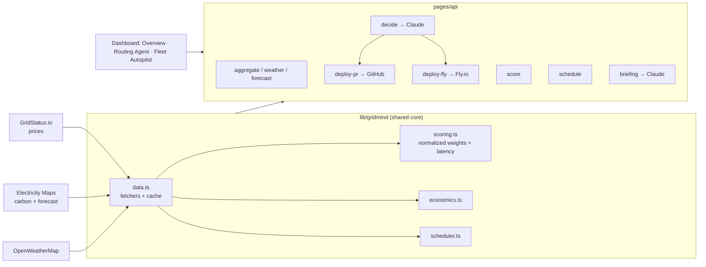

# GridMind

**Carbon- and cost-aware compute routing.** GridMind watches the live electricity grid and routes compute workloads to the **cheapest, cleanest** region and time — then an AI agent decides and **takes real action**, all within hard policy guardrails.

🔗 **Live demo:** https://gridmind-six.vercel.app

---

## The problem

AI and large-scale compute are exploding in both **cost** and **carbon**. But where and when you run a workload matters enormously:

- **Wholesale electricity prices swing wildly** by region and by hour — sometimes *negative* (surplus solar in California) and sometimes 3–5× higher elsewhere on the same grid.
- **Grid carbon intensity** varies just as much: a job in California at midday can be ~50 gCO₂/kWh while the same job in another region is ~400.

Yet teams typically pick a cloud region **once, statically**, and run everything there — leaving real money and emissions on the table. GridMind closes that gap.

## What it does

```
Live grid data  →  Agent decides (where + when)  →  Guardrails  →  Real action
  (price/carbon/      (Claude, with reasoning        (policy enforced    (GitHub PR
   forecast/latency)   + deterministic scoring)       in code)            or real deploy)
```

1. **Pulls live data** — real-time wholesale prices (GridStatus.io), grid carbon intensity + 24h forecast (Electricity Maps), and weather (OpenWeatherMap) for three real regions: **San Jose (CAISO)**, **Ashburn (PJM)**, **Austin (ERCOT)**.
2. **Scores every region** on a normalized blend of **cost, efficiency (PUE), carbon, and latency** — weights are tunable, with presets for *Training* (carbon-first), *Inference* (latency-first), and *Batch* (cost-first).
3. **An AI routing agent** (Claude) chooses the region **and** whether to run now or **defer** to a cleaner upcoming hour, and explains its reasoning.
4. **Guardrails are enforced in code** — policy constraints (allowed regions, max latency, max carbon) hard-filter the candidates *before* the model sees them, so it physically cannot violate them. All cost/CO₂ numbers are recomputed deterministically: **the model judges, the code does the arithmetic.**
5. **It takes real action:**
   - **GitOps PR** — opens a real GitHub pull request with a Kubernetes manifest pinned to the chosen region.
   - **Real deploy** — boots an actual [Fly.io](https://fly.io) machine in the chosen region (`sjc`/`iad`/`dfw`), then auto-destroys it.
6. **Fleet Autopilot** — a continuous scheduler routes a queue of jobs to the best region/time on its own, accumulating savings, with periodic LLM-written **operator briefings**.

## How the agent works

- **`/api/decide`** runs the routing agent. It pre-loads the live conditions, forecast, and projected costs, then makes a **single forced-tool call** (Claude **Sonnet 4.6**) that returns a structured decision — fast (~7s) and deterministic in shape.
- **Guardrails in code, not the prompt:** the policy filter removes disallowed regions up front; if none qualify, it returns a clean refusal *without* calling the model.
- **Deterministic recompute:** the agent picks the region and timing; the server recomputes the cost, CO₂, and savings, so the displayed numbers are always trustworthy.
- **Right tool for the job:** Claude is used where judgment matters (the decision, the operator briefings). The **fleet scheduler routes deterministically** in its hot loop — no LLM per job — so it scales, with the LLM reserved for the human-facing narrative.

## Architecture



- **Single source of truth** in `lib/gridmind/` — every route and the agent reuse the same scoring, data, and economics functions.
- **Three-tab UI** (`components/`): **Overview** (live monitoring), **Routing Agent** (single-job decide → real action), **Fleet Autopilot** (autonomous scheduler + briefings).

## Tech stack

- **Next.js 16** (Pages Router) · **React 19** · **TypeScript** · **Tailwind CSS v4**
- **Anthropic SDK** (Claude Sonnet 4.6) for the routing agent and operator briefings
- **GridStatus.io**, **Electricity Maps**, **OpenWeatherMap** for live grid + weather data
- Real actions via the **GitHub** and **Fly.io Machines** REST APIs
- Deployed on **Vercel** (auto-deploys on push; data endpoints edge-cached with stale-while-revalidate)

## Integrations — how systems plug in

GridMind is **API-first**: a dashboard is for evaluating and observing, but real adoption is GridMind embedded in your pipeline.

- **REST API** — `POST /api/decide` (agentic decision) and `POST /api/schedule` (fast deterministic batch routing) return `{region, run_now, defer_hours, projected, savings}`. Call them from your orchestration code:
  ```bash
  curl -s -X POST https://gridmind-six.vercel.app/api/schedule \
    -H 'content-type: application/json' \
    -d '{"jobs":[{"id":"job1","mw":50,"hours":12,"flexible":true,"profile":"training"}]}'
  ```
- **MCP server** (`mcp/`) — exposes GridMind as tools (`get_grid_conditions`, `route_workload`, `deploy_to_region`, `open_deployment_pr`) so any agent — Claude Code, Claude Desktop, your own — can **observe → route → act**. See [`mcp/README.md`](mcp/README.md).
- **GitOps** — the agent opens a real pull request with a Kubernetes manifest pinned to the chosen region; merge to deploy. Drops into existing CI/CD.

> Roadmap: Kubernetes scheduler plugin, Slurm/Airflow/Ray operators, Terraform provider, and a CLI — so workloads are placed with no human in the loop.

## Run locally

```bash
npm install
cp .env.example .env.local   # then fill in your keys
npm run dev                  # http://localhost:3000
```

Required environment variables (see `.env.example`):

| Variable | Used for |
|---|---|
| `ANTHROPIC_API_KEY` | the routing agent + operator briefings |
| `GRIDSTATUS_API_KEY` | real-time wholesale electricity prices |
| `ELECTRICITY_MAPS_AUTH_TOKEN` | grid carbon intensity + 24h forecast |
| `OPENWEATHERMAP_API_KEY` | regional weather |
| `GITHUB_TOKEN` | *(optional)* GitOps PR action — Contents + Pull requests: R/W |
| `FLY_API_TOKEN` | *(optional)* real Fly.io deploy — a **deploy** token |

> Without the optional tokens, the agent still decides and explains; the deploy buttons just won't fire. Without the data keys, prices/carbon fall back to representative constants.

## Roadmap (productionization)

- **Bring-your-own-cloud:** per-tenant credential vaults so the agent deploys into the *customer's* infrastructure (Kubernetes / cloud / Slurm), not a shared account.
- **More regions** — a full multi-ISO fleet view.
- **MCP server** — expose GridMind's capabilities as tools any agent can call.
- **Closed-loop learning** — measure predicted vs. actual and adjust future decisions.
- **Eval pipeline** — automated guardrail / optimality / consistency tests.

---

*Built at a hackathon. The deploys target a demo Fly.io account; in production each company connects its own cloud.*
